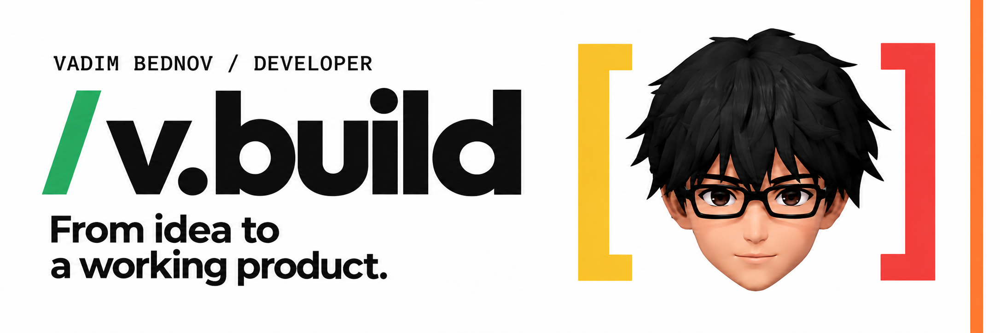

<b>EN</b> / <a href="https://github.com/vaoaoadim/vaoaoadim/blob/main/README.ru.md">RU</a>

# Interfaces with character. Products that work.

I'm **Vadim Bednov**, an independent developer behind **v.build**. I build websites, web apps, Telegram mini apps, bots, extensions and automations — from the interface to the backend, database and integrations.

**Have a project in mind? Let's talk.**

## 01 / What I can build for you

- **Websites & web apps** — expressive, responsive interfaces and the systems behind them.
- **Telegram products** — mini apps, bots, notifications and service integrations.
- **Interactive experiences** — promotional games and business gamification.
- **Tools & automation** — browser extensions, APIs, workflows and AI integrations.
- **Much much more)**

I take care of the full product: frontend, server-side logic, data and third-party services. Project handover includes **support and a detailed FAQ**.

## Selected work

### [ХОЧЕЦА / Hochetsa ↗](https://t.me/hochesa_bot)

**Telegram mini app · Wishlists**

Wishlists for you and your loved ones. A place to collect gift ideas and make choosing a present easier.

[Open in Telegram](https://t.me/hochesa_bot)

### [BeautyBomb Delivery ↗](https://beautybomb-delivery.vercel.app)

**Browser game · Phaser 3.90**

An arcade delivery game explored as an **independent portfolio concept**, not a commissioned BeautyBomb project.

[Play the game](https://beautybomb-delivery.vercel.app) · [View code](https://github.com/vaoaoadim/BeautyBomb-delivery-game)

### [Pläner ↗](https://planer-eight.vercel.app)

**Web app · Personal planning**

A cozy weekly planner for tasks, sleep, mood, energy, habits, a calendar and personal statistics.

[Open Pläner](https://planer-eight.vercel.app) · [Public project page](https://github.com/vaoaoadim/Planer-app)

## 02 / Tools, chosen for the task

**Frontend** — React · TypeScript · JavaScript · Vite · HTML/CSS · GSAP  
**Backend & data** — Node.js · REST APIs · Webhooks · PostgreSQL · Supabase · Firebase  
**Integrations** — Telegram Bot API · Payment & email workflows · OpenAI API · RAG  
**Delivery** — Git · GitHub · CI/CD · Vercel · Cloudflare

The stack is not limited to the above, but is selected individually for each task.

<b>Have an idea, but no technical brief yet?</b>

Send me a short description of who the product is for, what it should help them do, and any examples you like. If you have a deadline or budget range, include those too. We can start with the idea, not a perfect specification.

[Message on Telegram](https://t.me/vaoaoadim) or email **vbednov921@gmail.com**.

## 03 / Building, one contribution at a time

Public GitHub activity only. Refreshed daily; animation stops with reduced motion. This is a separate visualization, not a replacement for GitHub's native calendar.

---

**Let's turn your idea into a working product.** [Start a conversation ↗](https://t.me/vaoaoadim)
